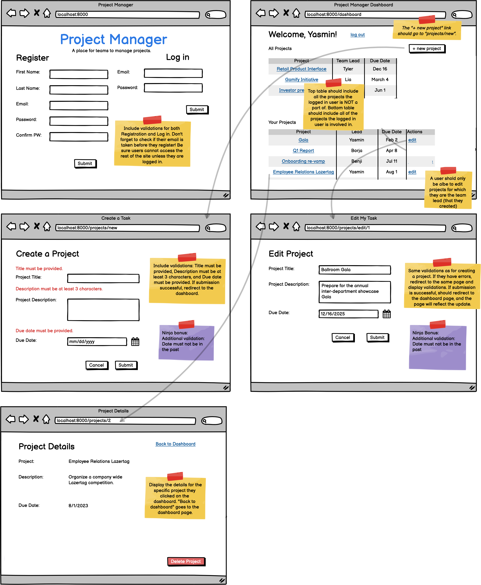

# Belt Review for Java (Revised Project Manager)

## Wireframe

## Requirements
1. Auth
    1. Validation for register & login
    1. Successful register
    1. Successful login
    1. Successful logout
    1. Route protection using the session (no access for logged-out user )
1. CRUD
    1. Create form validation
    1. Successful create with 1:n (logged-in user as the teamlead)
    1. Dashboard that shows all projects
    1. Edit form with validation
    1. Edit form without losing the 1:n relationship
    1. Successful Edit
    1. Successful Delete
1. Database & routing
    1. Follow RESTful routing (PUT for edit, DELETE for delete)
    1. Model with correctly built 1:n relationships
